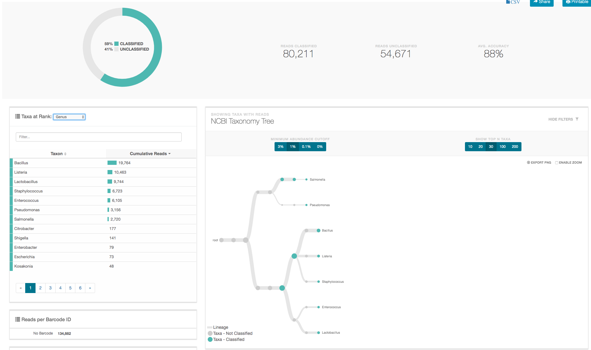
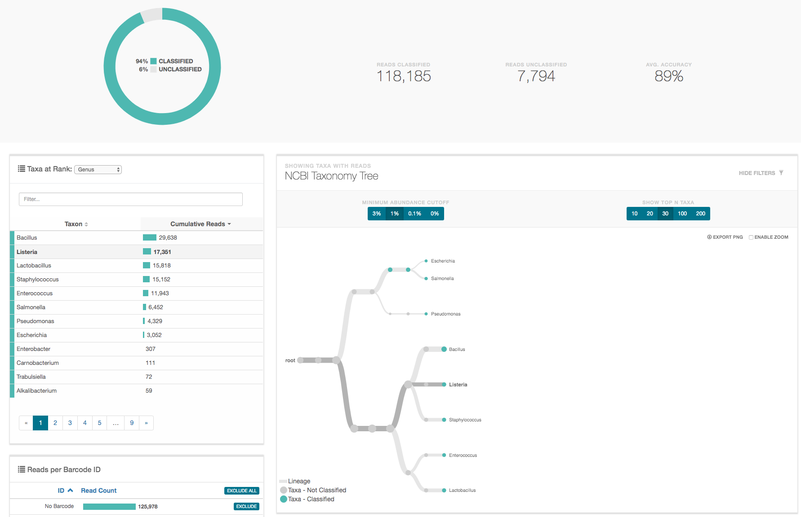

## Summary

The gDNA **Zymo-PromethION-EVEN-BB-SN** reads data from [the mockcommunity](https://github.com/LomanLab/mockcommunity) was used as input to extract either the 'full-length' amplicon corresponding to the PCR **27F-U1492R** [1](#f1) or the shorter V3V4 amplicon corresponding to the primer combination **337F-805R** [1](#f1).

The extracted reads were submitted to the ONT [16S Epi2Me pipeline](https://nanoporetech.com/nanopore-sequencing-data-analysis) to be classified and allow direct comparison of the two amplicon options at different levels.

## Results

* Epi2ME **genus** results for the **27F-U1492R** in-silico amplicon: [(link)](https://epi2me.nanoporetech.com/workflow_instance/214013)

<nbsp&;>*27F: "AGAGTTTGATCMTGGCTCAG"

<nbsp&;>*1492Rw: "CGGTWACCTTGTTACGACTT"

 

* Epi2ME **genus** results for the **337F-805R** in-silico amplicon: [(link)](https://epi2me.nanoporetech.com/workflow_instance/)

 

## References
<b id="f1">1</b> 16S_primers [Link](https://en.wikipedia.org/wiki/16S_ribosomal_RNA). [↩](#a1)
