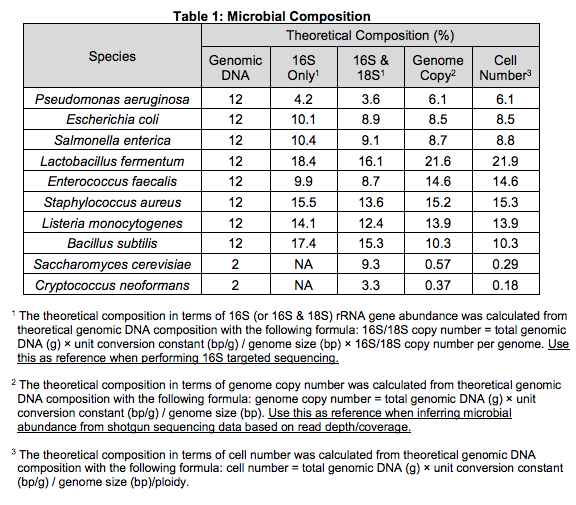
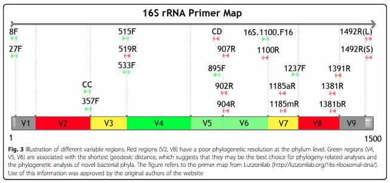
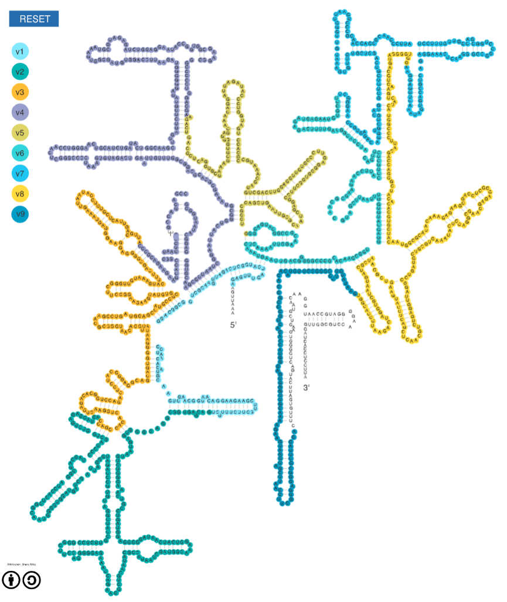
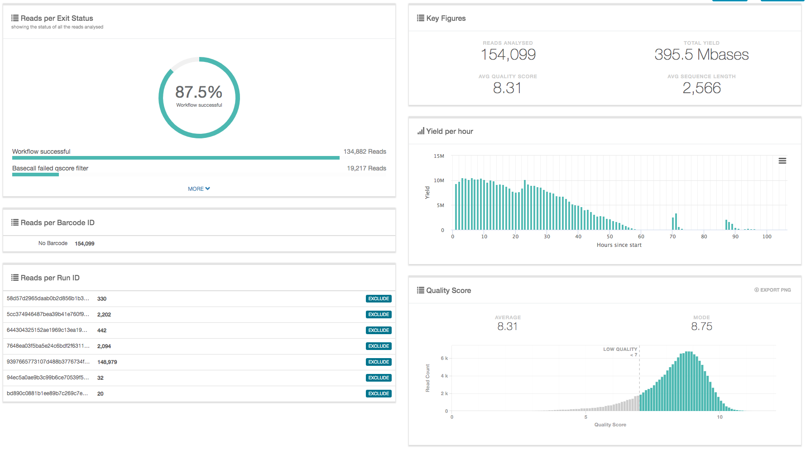
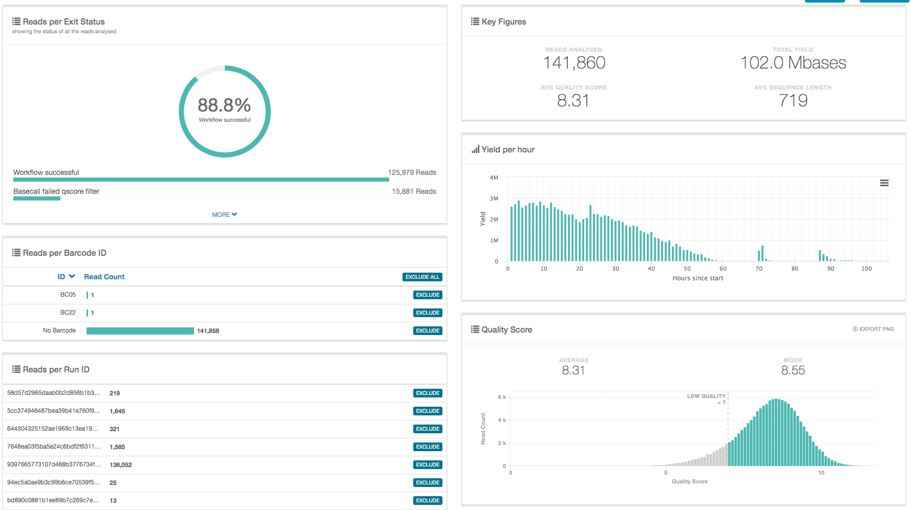
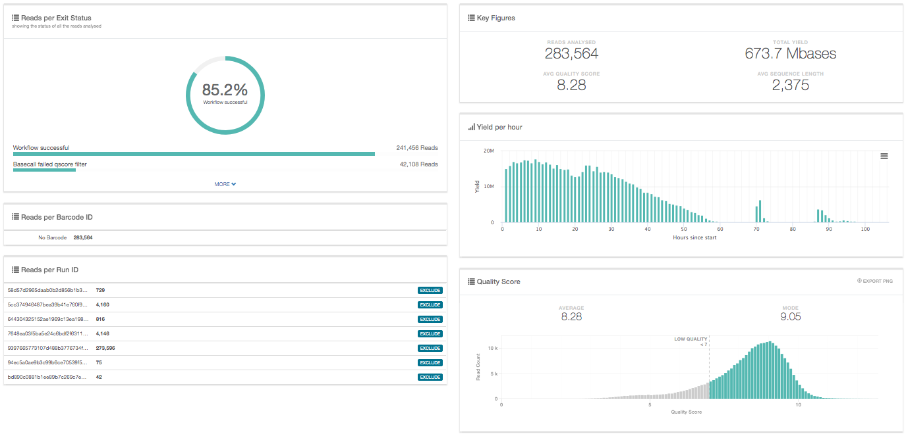
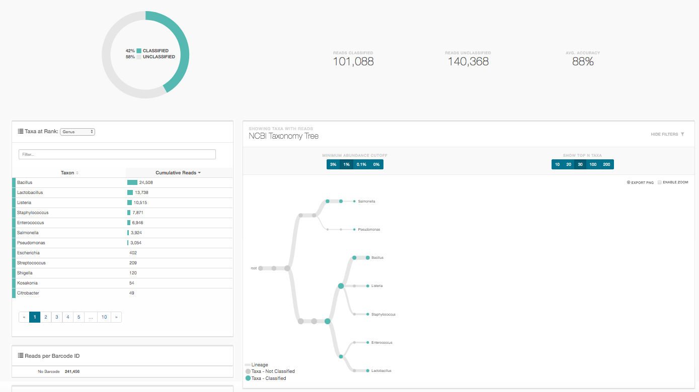
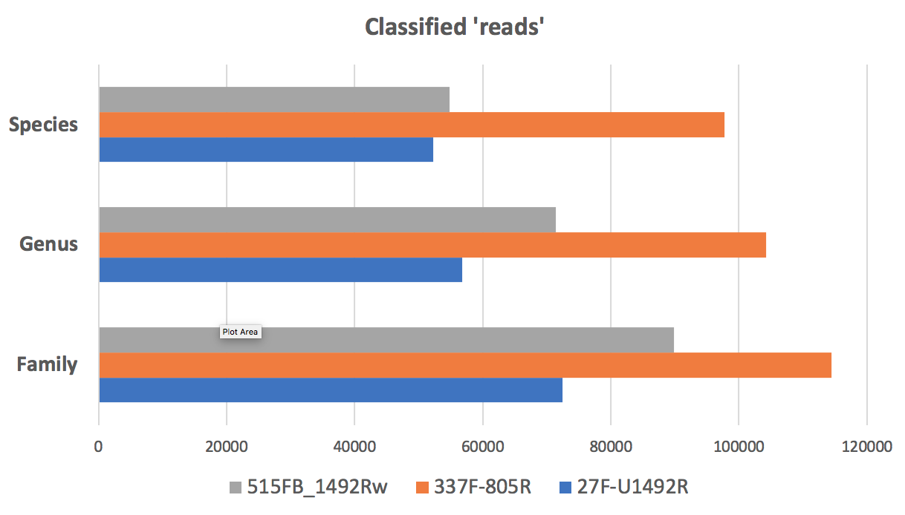

## Summary

In this short white paper we used ONT fastq data obtained after sequencing the **ZymoBIOMICS™ Microbial Community Standard** [1](#f1).

The corresponding Oxford nanopore gDNA reads data **Zymo-PromethION-EVEN-BB-SN** was downloaded from the **[Nanopore GridION and PromethION Mock Microbial Community Data Community Release](https://github.com/LomanLab/mockcommunity)**[2](#f2)

We used the gDNA reads as input to extract **In-Silico** either the **'full-length'** 16S amplicon corresponding to the PCR **27F-U1492R** [3a](#f3a), the shorter **V3V4** amplicon corresponding to the primer combination **337F-805R** [3a](#f3a), or a 'universal' amplicon corresponding to the combination **515FB-U1492Rw** [3a](#f3a).

We emit the hypothesis that the gDNA sequencing done on the Zymo standard is unbiased as a matter of 16S content and therefore represents the ideal material to assess the efficiency and specificity of the [ONT 16S analysis pipeline](https://nanoporetech.com/nanopore-sequencing-data-analysis)[4](#f4). 

In-Silico capture is not biased by primer mismatches as a real PCR would be, the captured subsets are therefore probably more diverse than real amplicons would be and should constitute a superseed of the in-vitro truth. 

The next figure represents the 16s region with variable domains as coloured blocks, and the arrows indicate the approximate location of the primers including several used here.

  taken from [3b](#f3b)

  taken from [theMicrobiomeViewer](http://themicrobiome.com/media/16S_viewer.cfm)

## Method

The read sets produced by our [code](https://github.com/Nucleomics-VIB/InSilico_PCR/raw/master/InSilico_PCR.sh) were submitted to the [ONT 16S analysis pipeline](https://nanoporetech.com/nanopore-sequencing-data-analysis) to be classified and allow direct comparison of the three amplicon options at different levels (only Genus is shown but the full data is provided in the 'results' folder).

## Results

### **27F-U1492R** in-silico amplicon (~1.4kb)

* Epi2ME **genus** results for the **27F-U1492R** in-silico amplicon: [(link)](https://epi2me.nanoporetech.com/workflow_instance/214013?token=E2EC0ED6-D91D-11E9-8C06-8D18643BF1F3)
   * 27F: "AGAGTTTGATCMTGGCTCAG"
   * 1492Rw: "CGGTWACCTTGTTACGACTT"
   * [epi2me results](https://github.com/Nucleomics-VIB/InSilico_PCR/raw/master/results/27F-U1492R_214013_classification_16s_barcode-v1.csv)

 

 

### **337F-805R** in-silico amplicon (~400bps)

* Epi2ME **genus** results for the **337F-805R** in-silico amplicon: [(link)](https://epi2me.nanoporetech.com/workflow_instance/214508?token=B58DA58A-DB93-11E9-8763-E0CFBA8D1717)
   * 337F: "GACTCCTACGGGAGGCWGCAG"
   * 805R: "GACTACHVGGGTATCTAATCC"
   * [epi2me results](https://github.com/Nucleomics-VIB/InSilico_PCR/raw/master/results/337F-805R_214508_classification_16s_barcode-v1.csv.zip)

 

 

### **515FB-U1492Rw** in-silico amplicon (~850bps)

* Epi2ME **genus** results for the **515FB-U1492Rw** in-silico amplicon: [(link)](https://epi2me.nanoporetech.com/workflow_instance/214579?token=F654DE94-DC5B-11E9-A3B0-9C43BB8D1717)
   * 515FB: "GTGYCAGCMGCCGCGGTAA"
   * U1492Rw: "CGGTWACCTTGTTACGACTT"
   * [epi2me results](https://github.com/Nucleomics-VIB/InSilico_PCR/raw/master/results/515FB-U1492Rw_214579_classification_16s_barcode-v1.csv.zip)

 

 

## Comparing the results

The amount of data extracted by teh different InSilico PCR runs appears different. This is probably due to false-positive 'reads' that are extracted by BBMap and are either not true 'amplicons' or are not clipped at one end, thereby carrying over ngenomic sequence outside of the amplicon region.

When plotting the count of classified reads in each run, we see that the quantities are closer to each other with an apparent higher yield for the **337F-805R** dataset (~2x more reads). This is likely due to the better match of the primer set with the diversity of targets present in the Zymo population (my simple explanation, not tested by re-extracting data with a different primer-pair).

  

The expected species composition (%) obtained from the Zymo documentation and our results are as follows (sorted alphabetically and two yeast genomes removed):

| species                 |  Zymo | 27F-U1492R | 337F-805R | 515FB_1492Rw |
|-------------------------|:-----:|:----------:|:---------:|:------------:|
| Bacillus halotolerans   |   .   |    8,4%    |    1,8%   |     5,2%     |
| Bacillus mojavensis     |   .   |    10,1%   |   24,9%   |     12,0%    |
| Bacillus subtilis       | 17,4% |    11,6%   |    2,1%   |     **15,7%**    |
| Bacillus vallismortis   |   .   |    2,9%    |     .     |     3,2%     |
| Enterococcus faecalis   |  9,9% |    10,6%   |   11,2%   |     **9,6%**     |
| Escherichia coli        | 10,1% |     .      |    **1,1%**   |      .       |
| Escherichia fergusonii  |   .   |     .      |    **1,8%**   |      .       |
| Lactobacillus fermentum | 18,4% |    15,3%   |   **15,8%**   |     15,7%    |
| Lactobacillus gastricus |   .   |    1,7%    |     .     |      .       |
| Lactobacillus suebicus  |   .   |     .      |     .     |     3,1%     |
| Listeria innocua        |   .   |    2,7%    |     .     |     **10,7%**    |
| Listeria monocytogenes  | 14,1% |     .      |     .     |      .       |
| Listeria welshimeri     |   .   |    14,9%   |     .     |     **5,4%**     |
| Listeria welshimeri     |   .   |     .      |   16,0%   |      .       |
| Pseudomonas aeruginosa  |  4,2% |    5,6%    |    **4,1%**   |     4,5%     |
| Salmonella enterica     | 10,4% |    5,2%    |    6,5%   |     **7,2%**     |
| Staphylococcus aureus   | 15,5% |    10,9%   |   **13,9%**   |     7,7%     |
| Staphylococcus petrasii |   .   |     .      |    **0,9%**   |      .       |

('.' absent; in bold, the closest **species** hit(s) from this anaysis)

Results at **Genus** level were obtained by adding up all related species and shown next

| genus          | Zymo  | 27F-U1492R | 337F-805R | 515FB_1492Rw |
|----------------|-------|------------|-----------|--------------|
| Bacillus       | 17,4% | 33,1%      | **28,8%**     | 36,1%        |
| Enterococcus   | 9,9%  | 10,6%      | 11,2%     | **9,6%**         |
| Escherichia    | 10,1% |  .         | **2,9%**      |   .          |
| Lactobacillus  | 18,4% | 17,0%      | 15,8%     | **18,8%**        |
| Listeria       | 14,1% | 17,6%      | **16,0%**     | 16,2%        |
| Pseudomonas    | 4,2%  | 5,6%       | **4,1%**      | 4,5%         |
| Salmonella     | 10,4% | 5,2%       | 6,5%      | **7,2%**         |
| Staphylococcus | 15,5% | 10,9%      | **14,7%**     | 7,7%         |

The second PCR (V4) shows most similarity with the expected ratio and Escherichia is still lagging behind and is the main responsible for the difference between theoretical Zymo numbers and numbers from this experiment. Interestingly, such a broad difference is not apparent in the recent paper by *Karst et al* [5](#f5)

## Discussion

Results obtained with this public data show that the ONT analysis pipeline is relatively robust when comparing three PCR amplicons and returns quasi identical classification at species level.

The final composition of the Zymo community does not fully match the expected relative abundance of the 8 species spiked into the commercial sample.

* Escherichia coli is absent from the analysis results, except in the 337F-805R results.
* Bacillus is represented by four separate species (subtilis, mojavensis, halotolerans, vallismortis) in the data while only expected as the single species 'subtilis' from the Zymo documentation.

Although we cannot exclude that the classification may be biased by high degree of sequence identity between these species due to the database used in the pipeline, we cannot either rule out that the Zymo sample also has issues concerning the proportion of the different genus as suggested in the genomic report published by *Sze & Schloss* [6](#f6).

This analysis suggests that the 16 pipeline is able to correctly classify the relatively simple Zymo community but may be biased in some ways and could make wrong assessments when working with more complex communities.

## References

<b id="f1">1</b> ZymoBIOMICS™ Microbial Community Standard (Catalog No. D6300) [link](https://files.zymoresearch.com/protocols/_d6300_zymobiomics_microbial_community_standard.pdf) [↩](#a1)

<b id="f2">2</b> Ultra-deep, long-read nanopore sequencing of mock microbial community standards [Link](https://www.biorxiv.org/content/10.1101/487033v2). [↩](#a2)

<b id="f3A">3a</b> 16S ribosomal RNA [Link](https://en.wikipedia.org/wiki/16S_ribosomal_RNA). [↩](#a3a)

<b id="f3b">3b</b> Sensitivity and correlation of hypervariable regions in 16S rRNA genes in phylogenetic analysis.
Yang B, Wang Y, Qian PY. [Link](https://bmcbioinformatics.biomedcentral.com/articles/10.1186/s12859-016-0992-y). [↩](#a3b)

<b id="f4">4</b> Analysis solutions for nanopore sequencing data [link](https://nanoporetech.com/nanopore-sequencing-data-analysis). [↩](#a4)

<b id="f5">5</b> Enabling high-accuracy long-read amplicon sequences using unique molecular identifiers and Nanopore sequencing. Soren Karst, Ryan M. Ziels, Rasmus H. Kirkegaard and Mads Albertsen [link](https://www.biorxiv.org/content/10.1101/645903v2). [↩](#a5)

<b id="f6">6</b> The impact of DNA polymerase and number of
rounds of amplification in PCR on 16S rRNA
gene sequence data. Marc A Sze & Patrick D Schloss [link](https://www.biorxiv.org/content/10.1101/565598v2). [↩](#a6)
