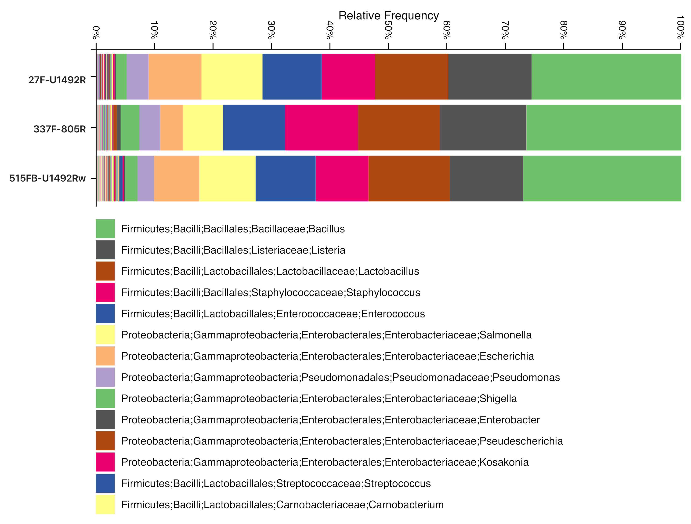

## Summary

In this short white paper we used ONT fastq data obtained after sequencing the **ZymoBIOMICS™ Microbial Community Standard** [1](#f1).

The corresponding Oxford nanopore gDNA reads data **Zymo-PromethION-EVEN-BB-SN** was downloaded from the **[Nanopore GridION and PromethION Mock Microbial Community Data Community Release](https://github.com/LomanLab/mockcommunity)**[2](#f2)

We used the gDNA reads as input to extract **In-Silico** either the **'full-length'** 16S amplicon corresponding to the PCR **27F-U1492R** [3](#f3), the shorter **V3V4** amplicon corresponding to the primer combination **337F-805R** [3](#f3), or a 'universal' amplicon corresponding to the combination **515FB-U1492Rw** [3](#f3).

We emit the hypothesis that the gDNA sequencing done on the Zymo standard is unbiased as a matter of 16S content and therefore represents the ideal material to assess the efficiency and specificity of the [ONT 16S analysis pipeline](https://nanoporetech.com/nanopore-sequencing-data-analysis)[4](#f4). 

In-Silico capture is not biased by primer mismatches as a real PCR would be, the captured subsets are therefore probably more diverse than real amplicons would be and should constitute a superseed of the in-vitro truth. 

The next figure represents the 16s region with variable domains as coloured blocks and a 2D model from *the Microbiome*.

  taken from [5](#f5)

  taken from [theMicrobiomeViewer](http://themicrobiome.com/media/16S_viewer.cfm)

The next figure shows arrows indicating the location of the 16S primers used here in the context of the E. coli reference genome (*NC000913*).

 

## Method

The read sets produced by our [code](https://github.com/Nucleomics-VIB/InSilico_PCR/raw/master/InSilico_PCR.sh) were submitted to the [ONT 16S analysis pipeline](https://nanoporetech.com/nanopore-sequencing-data-analysis) to be classified and allow direct comparison of the three amplicon options at different levels (only Genus is shown but the full data is provided in the 'results' folder).

For comparison, 10% of the reads in each set were used for a second analysis using **[MetONTIIME](https://github.com/MaestSi/MetONTIIME)** [6](#f6)

### epi2me results

REM: results shown below were obtained with a minimum abundance cutoff of 1% set on the epi2me interface. The 'counts' are therefore only coming from 'classes' with >1% read support in the data.

### **27F-U1492R** in-silico amplicon (~1.4kb)

* Epi2ME **genus** results for the **27F-U1492R** in-silico amplicon: [(link)](https://epi2me.nanoporetech.com/workflow_instance/214013?token=E2EC0ED6-D91D-11E9-8C06-8D18643BF1F3)
   * 27F: "AGAGTTTGATCMTGGCTCAG"
   * 1492Rw: "CGGTWACCTTGTTACGACTT"
   * [epi2me results](https://github.com/Nucleomics-VIB/InSilico_PCR/raw/master/results/27F-U1492Rw_214013_classification_16s_barcode-v1.csv.zip)

 

 

### **337F-805R** in-silico amplicon (~400bps)

* Epi2ME **genus** results for the **337F-805R** in-silico amplicon: [(link)](https://epi2me.nanoporetech.com/workflow_instance/214508?token=B58DA58A-DB93-11E9-8763-E0CFBA8D1717)
   * 337F: "GACTCCTACGGGAGGCWGCAG"
   * 805R: "GACTACHVGGGTATCTAATCC"
   * [epi2me results](https://github.com/Nucleomics-VIB/InSilico_PCR/raw/master/results/337F-805R_214508_classification_16s_barcode-v1.csv.zip)

 

 

### **515FB-U1492Rw** in-silico amplicon (~850bps)

* Epi2ME **genus** results for the **515FB-U1492Rw** in-silico amplicon: [(link)](https://epi2me.nanoporetech.com/workflow_instance/214579?token=F654DE94-DC5B-11E9-A3B0-9C43BB8D1717)
   * 515FB: "GTGYCAGCMGCCGCGGTAA"
   * U1492Rw: "CGGTWACCTTGTTACGACTT"
   * [epi2me results](https://github.com/Nucleomics-VIB/InSilico_PCR/raw/master/results/515FB-U1492Rw_214579_classification_16s_barcode-v1.csv.zip)

 

 

## Comparing the results

### ONT results vs Zymo community

The amount of data extracted by the different InSilico PCR runs shows different size distributions. This is probably due to 'reads' that are extracted by BBMap and are either not true 'amplicons' or are not clipped at one end, thereby carrying over genomic sequence outside of the amplicon region.

When plotting the count of classified reads in each run, we see that the quantities are closer to each other with an apparent higher yield for the **337F-805R** dataset (~2x more reads). This is likely due to the better match of the primer set with the diversity of targets present in the Zymo population (my simple explanation, not tested by re-extracting data with a different primer-pair).

  

The expected species composition (%) obtained from the Zymo documentation and our results are as follows (sorted alphabetically and two yeast genomes removed):

Please note that we counted here only classifications contributed by >1% of the reads (epi2me interface default). Since we are studying a defined community, keeping lower classifications would mainly add noise to the counts. This also implies that we loose a substancial number of reads in the process (close to 30% in some sets).

| species                 |  Zymo | 27F-U1492R | 337F-805R | 515FB_1492Rw |
|-------------------------|:-----:|:----------:|:---------:|:------------:|
| Bacillus halotolerans   |   .   |    8,4%    |    1,8%   |     5,2%     |
| Bacillus mojavensis     |   .   |    10,1%   |   24,9%   |     12,0%    |
| Bacillus subtilis       | 17,4% |    11,6%   |    2,1%   |     **15,7%**    |
| Bacillus vallismortis   |   .   |    2,9%    |     .     |     3,2%     |
| Enterococcus faecalis   |  9,9% |    10,6%   |   11,2%   |     **9,6%**     |
| Escherichia coli        | 10,1% |     .      |    **1,1%**   |      .       |
| Escherichia fergusonii  |   .   |     .      |    **1,8%**   |      .       |
| Lactobacillus fermentum | 18,4% |    15,3%   |   **15,8%**   |     15,7%    |
| Lactobacillus gastricus |   .   |    1,7%    |     .     |      .       |
| Lactobacillus suebicus  |   .   |     .      |     .     |     3,1%     |
| Listeria innocua        |   .   |    2,7%    |     .     |     **10,7%**    |
| Listeria monocytogenes  | 14,1% |     .      |     .     |      .       |
| Listeria welshimeri     |   .   |    14,9%   |   16,0%   |     **5,4%**     |
| Pseudomonas aeruginosa  |  4,2% |    5,6%    |    **4,1%**   |     4,5%     |
| Salmonella enterica     | 10,4% |    5,2%    |    6,5%   |     **7,2%**     |
| Staphylococcus aureus   | 15,5% |    10,9%   |   **13,9%**   |     7,7%     |
| Staphylococcus petrasii |   .   |     .      |    **0,9%**   |      .       |

('.' absent; in bold, the closest **species** hit(s) from this anaysis)

Results at **Genus** level were obtained by adding up all related species and shown next

| genus          | Zymo  | 27F-U1492R | 337F-805R | 515FB_1492Rw |
|----------------|-------|------------|-----------|--------------|
| Bacillus       | 17,4% | 33,1%      | **28,8%**     | 36,1%        |
| Enterococcus   | 9,9%  | 10,6%      | 11,2%     | **9,6%**         |
| Escherichia    | 10,1% |  .         | **2,9%**      |   .          |
| Lactobacillus  | 18,4% | 17,0%      | 15,8%     | **18,8%**        |
| Listeria       | 14,1% | 17,6%      | **16,0%**     | 16,2%        |
| Pseudomonas    | 4,2%  | 5,6%       | **4,1%**      | 4,5%         |
| Salmonella     | 10,4% | 5,2%       | 6,5%      | **7,2%**         |
| Staphylococcus | 15,5% | 10,9%      | **14,7%**     | 7,7%         |

('.' absent; in bold, the closest **genus** hit(s) from this anaysis)

The second PCR (V4) shows most similarity with the expected ratio and Escherichia is still lagging behind and is the main responsible for the difference between theoretical Zymo numbers and numbers from this experiment. Interestingly, such a broad difference is not apparent in the recent paper by *Karst et al* [7](#f7)

### MetONTIIME results vs Zymo

**MetONTIIME** was recently created to offer an alternative to the ONT epi2me 'black-box' analysis solution. We show here a resuilt from MetONTIIME using the fastq data produced above in order to compare its results to those of ONT. Due to the size of the data, only the first 10% of each read set was used to classify the three amplicons.

We did not invest enough time in using MetONTIIME to allow full comparison to the ONT epi2me method and only did a quick run in order to get comparable data. It is very likely that the tool can produce better results and the fact that it its code is accessible makes it more suited for development and research applications including the possibility to change reference database and adapt the parameters to a given metagenomic environment.

The results of a default classification using out of the box parameters (and the PRJNA33175 reference database as described in the MetONTIIME doculentation) are reported in the table below, sorted by the first amplicon counts (*27F-U1492R*). **(§) Due to time/server constrains, only the first 10% of the date were used to classify with MetONTIIME**.

* [metontiime results](https://github.com/Nucleomics-VIB/InSilico_PCR/raw/master/results/MetONTIIME_results.csv) derived from the file **species_counts.txt**.

| OTU ID                         | 27F-U1492R (§) | 337F-805R (§) | 515FB-U1492Rw (§) | Zymo  | 27F-U1492R (%) | 337F-805R (%) | 515FB-U1492Rw (%) |
|--------------------------------|----------------|---------------|-------------------|-------|----------------|---------------|-------------------|
| Bacillus halotolerans          | 1335           | 718           | 1263              | .     | 15,8%          | 5,9%          | 11,9%             |
| Lactobacillus fermentum        | 1074           | 1775          | 1229              | 18,4% | **12,7%**          | 14,6%         | 11,6%             |
| Salmonella enterica            | 938            | 884           | 1105              | 10,4% | 11,1%          | 7,3%          | **10,4%**             |
| Enterococcus faecalis          | 817            | 1281          | 887               | 9,9%  | **9,6%**           | 10,6%         | 8,4%              |
| Staphylococcus aureus          | 650            | 368           | 736               | 15,5% | **7,7%**           | 3,0%          | 6,9%              |
| Escherichia fergusonii         | 682            | 322           | 711               | .     | 8,0%           | 2,7%          | 6,7%              |
| Listeria innocua               | 435            | 258           | 665               | 15,5% | 5,1%           | 2,1%          | **6,3%**              |
| Bacillus mojavensis            | 331            | 2165          | 548               | .     | 3,9%           | 17,8%         | 5,2%              |
| Listeria welshimeri            | 671            | 333           | 543               | .     | 7,9%           | 2,7%          | 5,1%              |
| Bacillus vallismortis          | 247            | 145           | 501               | .     | 2,9%           | 1,2%          | 4,7%              |
| Pseudomonas aeruginosa         | 319            | 422           | 312               | 4,2%  | **3,8%**           | 3,5%          | 2,9%              |
| Bacillus subtilis              | 185            | 178           | 180               | 17,4% | **2,2%**           | 1,5%          | 1,7%              |
| Listeria seeligeri             | 132            | 73            | 169               | .     | 1,6%           | 0,6%          | 1,6%              |
| Bacillus sporothermodurans     | 1              | 2             | 127               | .     | 0,0%           | 0,0%          | 1,2%              |
| Escherichia marmotae           | 105            | 75            | 119               | .     | 1,2%           | 0,6%          | 1,1%              |
| Staphylococcus petrasii        | 50             | 47            | 116               | .     | 0,6%           | 0,4%          | 1,1%              |
| Lactobacillus suebicus         | 4              | 1             | 112               | .     | 0,0%           | 0,0%          | 1,1%              |
| Bacillus atrophaeus            | 4              | 12            | 105               | .     | 0,0%           | 0,1%          | 1,0%              |
| Shigella sonnei                | 80             | 30            | 99                | .     | 0,9%           | 0,2%          | 0,9%              |
| Shigella flexneri              | 68             | 370           | 96                | .     | 0,8%           | 3,0%          | 0,9%              |
| Enterococcus italicus          | 1              | 1             | 91                | .     | 0,0%           | 0,0%          | 0,9%              |
| Lactobacillus equigenerosi     | 5              | 4             | 67                | .     | 0,1%           | 0,0%          | 0,6%              |
| Lactobacillus pentosus         | 0              | 0             | 58                | .     | 0,0%           | 0,0%          | 0,5%              |
| Lactobacillus gastricus        | 1              | 8             | 56                | .     | 0,0%           | 0,1%          | 0,5%              |
| Enterococcus avium             | 34             | 22            | 47                | .     | 0,4%           | 0,2%          | 0,4%              |
| Staphylococcus haemolyticus    | 28             | 20            | 47                | .     | 0,3%           | 0,2%          | 0,4%              |
| Staphylococcus hominis         | 27             | 25            | 45                | .     | 0,3%           | 0,2%          | 0,4%              |
| Staphylococcus simiae          | 26             | 1085          | 45                | .     | 0,3%           | 8,9%          | 0,4%              |
| Escherichia albertii           | 26             | 24            | 44                | .     | 0,3%           | 0,2%          | 0,4%              |
| Shigella boydii                | 19             | 16            | 41                | .     | 0,2%           | 0,1%          | 0,4%              |
| Bacillus hisashii              | 0              | 0             | 34                | .     | 0,0%           | 0,0%          | 0,3%              |
| Bacillus licheniformis         | 23             | 25            | 29                | .     | 0,3%           | 0,2%          | 0,3%              |
| Escherichia coli               | 8              | 96            | 26                | 10,1% | 0,1%           | **0,8%**          | 0,2%              |
| Enterococcus pseudoavium       | 0              | 0             | 24                | .     | 0,0%           | 0,0%          | 0,2%              |
| Anaerobacillus macyae          | 0              | 0             | 23                | .     | 0,0%           | 0,0%          | 0,2%              |
| Listeria ivanovii              | 14             | 1240          | 23                | .     | 0,2%           | 10,2%         | 0,2%              |
| Enterococcus wangshanyuanii    | 16             | 9             | 19                | .     | 0,2%           | 0,1%          | 0,2%              |
| Staphylococcus saccharolyticus | 19             | 9             | 19                | .     | 0,2%           | 0,1%          | 0,2%              |
| Bacillus decolorationis        | 0              | 0             | 18                | .     | 0,0%           | 0,0%          | 0,2%              |
| Enterococcus mundtii           | 0              | 3             | 18                | .     | 0,0%           | 0,0%          | 0,2%              |
| Bacillus berkeleyi             | 1              | 0             | 17                | .     | 0,0%           | 0,0%          | 0,2%              |
| Kosakonia sacchari             | 17             | 13            | 17                | .     | 0,2%           | 0,1%          | 0,2%              |
| Bacillus humi                  | 1              | 2             | 16                | .     | 0,0%           | 0,0%          | 0,2%              |
| Bacillus xiamenensis           | 8              | 4             | 15                | .     | 0,1%           | 0,0%          | 0,1%              |
| Bacillus isabeliae             | 10             | 6             | 14                | .     | 0,1%           | 0,0%          | 0,1%              |
| Enterobacter cloacae           | 14             | 31            | 14                | .     | 0,2%           | 0,3%          | 0,1%              |
| Enterococcus sulfureus         | 3              | 4             | 14                | .     | 0,0%           | 0,0%          | 0,1%              |
| Listeria marthii               | 9              | 3             | 14                | .     | 0,1%           | 0,0%          | 0,1%              |
| Listeria monocytogenes         | 13             | 16            | 14                | 14,1% | **0,2%**           | 0,1%          | 0,1%              |
| Streptococcus gallinaceus      | 0              | 0             | 14                | .     | 0,0%           | 0,0%          | 0,1%              |
| Streptococcus urinalis         | 0              | 0             | 14                | .     | 0,0%           | 0,0%          | 0,1%              |
| Enterococcus saccharolyticus   | 4              | 4             | 13                | .     | 0,0%           | 0,0%          | 0,1%              |
| Isobaculum melis               | 9              | 3             | 13                | .     | 0,1%           | 0,0%          | 0,1%              |
| Bacillus nematocida            | 10             | 5             | 12                | .     | 0,1%           | 0,0%          | 0,1%              |
| Planococcus maritimus          | 2              | 0             | 12                | .     | 0,0%           | 0,0%          | 0,1%              |
| Streptococcus parasanguinis    | 0              | 0             | 11                | .     | 0,0%           | 0,0%          | 0,1%              |
| total                          | 8476           | 12137         | 10621             | 100%  | 100% (sorted)          | 100%          | 100%              |

('.' absent; in bold, the closest **species** hit(s) from this anaysis)

The genus table was obtained by summing all species within each genus in the table above

| Genus          | Sum of 27F-U1492R (§) | Sum of 337F-805R (§) | Sum of 515FB-U1492Rw (§) |       | 27F-U1492R (%) | 337F-805R  (%) | 515FB-U1492Rw  (%) |
|----------------|-----------------------|----------------------|--------------------------|-------|----------------|----------------|--------------------|
| Bacillus       | 2156                  | 3262                 | 2879                     | 17,4% | **25,4%**      | 26,9%          | 27,1%              |
| Listeria       | 1274                  | 1923                 | 1428                     | 14,1% | 15,0%          | 15,8%          | **13,4%**          |
| Lactobacillus  | 1084                  | 1788                 | 1522                     | 18,4% | 12,8%          | **14,7%**      | 14,3%              |
| Salmonella     | 938                   | 884                  | 1105                     | 10,4% | 11,1%          | 7,3%           | **10,4%**          |
| Enterococcus   | 875                   | 1324                 | 1113                     | 9,9%  | **10,3%**      | 10,9%          | 10,5%              |
| Escherichia    | 821                   | 517                  | 900                      | 10,1% | **9,7%**       | 4,3%           | 8,5%               |
| Staphylococcus | 800                   | 1554                 | 1008                     | 15,5% | 9,4%           | **12,8%**      | 9,5%               |
| Pseudomonas    | 319                   | 422                  | 312                      | 4,2%  | **3,8%**       | 3,5%           | 2,9%               |
| Shigella       | 167                   | 416                  | 236                      |       | 2,0%           | 3,4%           | 2,2%               |
| Kosakonia      | 17                    | 13                   | 17                       |       | 0,2%           | 0,1%           | 0,2%               |
| Enterobacter   | 14                    | 31                   | 14                       |       | 0,2%           | 0,3%           | 0,1%               |
| Isobaculum     | 9                     | 3                    | 13                       |       | 0,1%           | 0,0%           | 0,1%               |
| Planococcus    | 2                     | 0                    | 12                       |       | 0,0%           | 0,0%           | 0,1%               |
| Anaerobacillus | 0                     | 0                    | 23                       |       | 0,0%           | 0,0%           | 0,2%               |
| Streptococcus  | 0                     | 0                    | 39                       |       | 0,0%           | 0,0%           | 0,4%               |
| Grand Total    | 8476                  | 12137                | 10621                    |       | 100,0% (sorted)        | 100,0%         | 100,0%             |

(in bold, the closest **genus** hit(s) from this anaysis)

## Discussion

Results obtained with this public data show that the ONT epi2me analysis pipeline is relatively robust when comparing three PCR amplicons and returns quasi identical classification dosn to species level.

MetONTIIME, although slow for such large datasets, due to a number of steps using a single cpu, also classifies the community in a relatively similar way. No quantitative analysis was done here to correlate the two tools since the MetONTIIME run was only done on partial data.

The final composition of the Zymo community using both approaches does not fully match the expected relative abundance of the 8 species spiked into the commercial sample.

* Escherichia coli is veru low to absent from the analysis results. The absent reads may have been classified in <1% classes that are not counted in the epi2me or transferred to other species with similar sequences.
* Bacillus is represented by four separate species (subtilis, mojavensis, halotolerans, vallismortis) in the data while only expected as the single species 'subtilis' from the Zymo documentation.
* Listeria monocytogenes is replaced mainly by Listeria welshimeri in both result sets.

Although we cannot exclude that the classification may be biased by high degree of sequence identity between species due to the database used in the pipeline, we cannot either rule out that the Zymo sample also has issues concerning the proportion of the different genus as suggested in the recent report published by *Sze & Schloss* [8](#f8).

This analysis suggests that the 16 pipeline is able to correctly classify the relatively simple Zymo community but suggests that it may be biased in some ways and could make wrong assessments when working with more complex communities. 

We also observe similar bias in the results when using the MetONTIIME tool which qualifies as a replacement for the ONT method but could benefit from speedup to better use the available computing resources (we thank the author for his kind help furing tool install and usage).

## Conclusion

This analysis was done to evaluate the use of Oxford nanopore genomic sequencing data for 16S metagenomic classification and compare different 16S amplicons.
We believe that this is possible but we acknowledge that our analysis is quite superficial and does not include quantitative evaluation of the results and proper comparison of the tools.
This 16S sequence extraction is only one example of what insilico PCR could allow and we think that other capture examples could help biologists focus on specific gene(s) or region(s) of interest starting from ONT full-genome data to answer specific questions.

## References

<b id="f1">1</b> ZymoBIOMICS™ Microbial Community Standard (Catalog No. D6300) [link](https://files.zymoresearch.com/protocols/_d6300_zymobiomics_microbial_community_standard.pdf) [↩](#a1)

<b id="f2">2</b> Ultra-deep, long-read nanopore sequencing of mock microbial community standards [Link](https://www.biorxiv.org/content/10.1101/487033v2). [↩](#a2)

<b id="f3">3</b> 16S ribosomal RNA [Link](https://en.wikipedia.org/wiki/16S_ribosomal_RNA). [↩](#a3)

<b id="f4">4</b> Analysis solutions for nanopore sequencing data [link](https://nanoporetech.com/nanopore-sequencing-data-analysis). [↩](#a4)

<b id="f5">5</b> Sensitivity and correlation of hypervariable regions in 16S rRNA genes in phylogenetic analysis.
Yang B et al. [Link](https://bmcbioinformatics.biomedcentral.com/articles/10.1186/s12859-016-0992-y). [↩](#a5)

<b id="f6">6</b> Maestri S. et al. A Rapid and Accurate MinION-Based Workflow for Tracking Species Biodiversity in the Field. [link](https://doi.org/10.3390/genes10060468). [↩](#a6)

<b id="f7">7</b> Enabling high-accuracy long-read amplicon sequences using unique molecular identifiers and Nanopore sequencing. Karst, A et al. [link](https://www.biorxiv.org/content/10.1101/645903v2). [↩](#a7)

<b id="f8">8</b> The impact of DNA polymerase and number of
rounds of amplification in PCR on 16S rRNA
gene sequence data. Marc A Sze & Patrick D Schloss [link](https://www.biorxiv.org/content/10.1101/565598v2). [↩](#a8)

