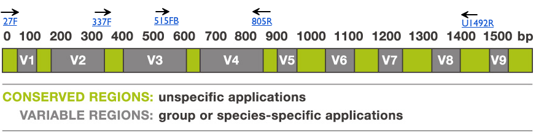

## Summary

The gDNA **Zymo-PromethION-EVEN-BB-SN** reads data from the **[Nanopore GridION and PromethION Mock Microbial Community Data Community Release](https://github.com/LomanLab/mockcommunity)**[1](#f1) was used as input to extract **In-Silico** either the **'full-length'** 16S amplicon corresponding to the PCR **27F-U1492R** [2](#f2), the shorter **V3V4** amplicon corresponding to the primer combination **337F-805R** [2](#f2), or a 'universal' amplicon corresponding to the combination **515FB-U1492Rw** [2](#f2).

We emit the hypothesis that the gDNA sequencing done on the Zymo standard is unbiased as a matter of 16S content. 

In-Silico capture is not biased by primer mismatches as a real PCR would be, the captured subsets are therefore probably more diverse than real amplicons would be and should constitute a superseed of the in-vitro truth. 

Taken together, this experiments could provide evidence for primer biases introduced by the different 16S pairs and may suggest that 16S screening as it is currently done by ONT should be thought more carefully when considering the Genus results obtained in the different runs shown here.

The next figure represents the 16s region with variable domains as dark blocks, spaced by more conserved regions.

## Method

The extracted read sets were submitted to the ONT [16S Epi2Me pipeline](https://nanoporetech.com/nanopore-sequencing-data-analysis) to be classified and allow direct comparison of the two amplicon options at different levels (only Genus is shown but the full data is provided in the 'results' folder).

## Results

### **27F-U1492R** in-silico amplicon

* Epi2ME **genus** results for the **27F-U1492R** in-silico amplicon: [(link)](https://epi2me.nanoporetech.com/workflow_instance/214013)
   * 27F: "AGAGTTTGATCMTGGCTCAG"
   * 1492Rw: "CGGTWACCTTGTTACGACTT"
   * [epi2me results](https://github.com/Nucleomics-VIB/InSilico_PCR/raw/master/results/27F-U1492R_214013_classification_16s_barcode-v1.csv)

 

 

### **337F-805R** in-silico amplicon

* Epi2ME **genus** results for the **337F-805R** in-silico amplicon: [(link)](https://epi2me.nanoporetech.com/workflow_instance/214508)
   * 337F: "GACTCCTACGGGAGGCWGCAG"
   * 805R: "GACTACHVGGGTATCTAATCC"
   * [epi2me results](https://github.com/Nucleomics-VIB/InSilico_PCR/raw/master/results/337F-805R_214508_classification_16s_barcode-v1.csv)

 

 

### **515FB-U1492Rw** in-silico amplicon

* Epi2ME **genus** results for the **515FB-U1492Rw** in-silico amplicon: [(link)](https://epi2me.nanoporetech.com/workflow_instance/214514)
   * 515FB: "GTGYCAGCMGCCGCGGTAA"
   * U1492Rw: "CGGTWACCTTGTTACGACTT"
   * [epi2me results](https://github.com/Nucleomics-VIB/InSilico_PCR/raw/master/results/515FB-U1492Rw_214514_classification_16s_barcode-v1.csv)

 

 

## Comparing the results

## References

<b id="f1">1</b> Ultra-deep, long-read nanopore sequencing of mock microbial community standards [Link](https://www.biorxiv.org/content/10.1101/487033v2. [↩](#a1)

<b id="f2">2</b> 16S ribosomal RNA [Link](https://en.wikipedia.org/wiki/16S_ribosomal_RNA). [↩](#a2)
