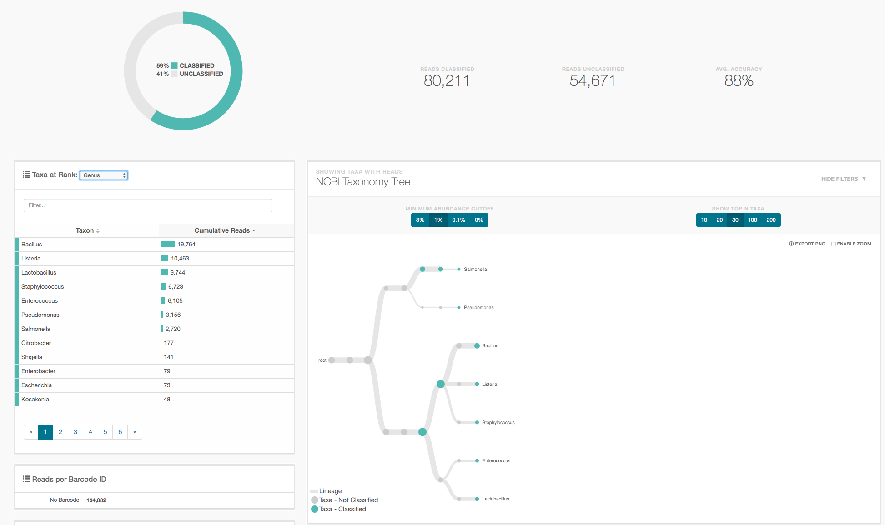

## Summary

In this short white papaer we used ONT data obtained from the **ZymoBIOMICS™ Microbial Community Standard** [1](#f1).

The corresponding Oxford nanopore gDNA reads data **Zymo-PromethION-EVEN-BB-SN** was obtained from the **[Nanopore GridION and PromethION Mock Microbial Community Data Community Release](https://github.com/LomanLab/mockcommunity)**[2](#f2) and used as input to extract **In-Silico** either the **'full-length'** 16S amplicon corresponding to the PCR **27F-U1492R** [3](#f3), the shorter **V3V4** amplicon corresponding to the primer combination **337F-805R** [3](#f3), or a 'universal' amplicon corresponding to the combination **515FB-U1492Rw** [3](#f3).

We emit the hypothesis that the gDNA sequencing done on the Zymo standard is unbiased as a matter of 16S content adn therefore represents the ideal material to assess the efficiency and specificity of the ONT 16S analysis pipeline. 

In-Silico capture is not biased by primer mismatches as a real PCR would be, the captured subsets are therefore probably more diverse than real amplicons would be and should constitute a superseed of the in-vitro truth. 

The next figure represents the 16s region with variable domains as dark blocks, spaced by more conserved regions and the arrows indicate the approximate location of the primers used here.

## Method

The read sets produced by our [code](https://github.com/Nucleomics-VIB/InSilico_PCR/raw/master/InSilico_PCR.sh) were submitted to the ONT [16S Epi2Me pipeline](https://nanoporetech.com/nanopore-sequencing-data-analysis) to be classified and allow direct comparison of the three amplicon options at different levels (only Genus is shown but the full data is provided in the 'results' folder).

## Results

### **27F-U1492R** in-silico amplicon

* Epi2ME **genus** results for the **27F-U1492R** in-silico amplicon: [(link)](My latest @metrichor #epi2me run report: https://epi2me.nanoporetech.com/workflow_instance/214013?token=E2EC0ED6-D91D-11E9-8C06-8D18643BF1F3)
   * 27F: "AGAGTTTGATCMTGGCTCAG"
   * 1492Rw: "CGGTWACCTTGTTACGACTT"
   * [epi2me results](https://github.com/Nucleomics-VIB/InSilico_PCR/raw/master/results/27F-U1492R_214013_classification_16s_barcode-v1.csv)

 

 

### **337F-805R** in-silico amplicon

* Epi2ME **genus** results for the **337F-805R** in-silico amplicon: [(link)](https://epi2me.nanoporetech.com/workflow_instance/214508?token=B58DA58A-DB93-11E9-8763-E0CFBA8D1717)
   * 337F: "GACTCCTACGGGAGGCWGCAG"
   * 805R: "GACTACHVGGGTATCTAATCC"
   * [epi2me results](https://github.com/Nucleomics-VIB/InSilico_PCR/raw/master/results/337F-805R_214508_classification_16s_barcode-v1.csv.zip)

 

 

### **515FB-U1492Rw** in-silico amplicon

* Epi2ME **genus** results for the **515FB-U1492Rw** in-silico amplicon: [(link)](https://epi2me.nanoporetech.com/workflow_instance/214579?token=F654DE94-DC5B-11E9-A3B0-9C43BB8D1717)
   * 515FB: "GTGYCAGCMGCCGCGGTAA"
   * U1492Rw: "CGGTWACCTTGTTACGACTT"
   * [epi2me results](https://github.com/Nucleomics-VIB/InSilico_PCR/raw/master/results/515FB-U1492Rw_214579_classification_16s_barcode-v1.csv.zip)

 

 

## Comparing the results

The expected composition (%) obtained from the Zymo documentation is as follows:

| Genus          | species       | genomic_DNA     | 16S  | 16S-18S | genome_copy | cell_number |
|----------------|---------------|-----------------|------|---------|-------------|-------------|
| Pseudomonas    | aeruginosa    | 12              | 4.2  | 3.6     | 6.1         | 6.1         |
| Escherichia    | coli          | 12              | 10.1 | 8.9     | 8.5         | 8.5         |
| Salmonella     | enterica      | 12              | 10.4 | 9.1     | 8.7         | 8.8         |
| Lactobacillus  | fermentum     | 12              | 18.4 | 16.1    | 21.6        | 21.9        |
| Enterococcus   | faecalis      | 12              | 9.9  | 8.7     | 14.6        | 14.6        |
| Staphylococcus | aureus        | 12              | 15.5 | 13.6    | 15.2        | 15.3        |
| Listeria       | monocytogenes | 12              | 14.1 | 12.4    | 13.9        | 13.9        |
| Bacillus       | subtilis      | 12              | 17.4 | 15.3    | 10.3        | 10.3        |
| Saccharomyces  | cerevisiae    | 2               | NA   | 9.3     | 0.57        | 0.29        |
| Cryptococcus   | neoformans    | 2               | NA   | 3.3     | 0.37        | 0.18        |

The species-level results for the three analyses are:

|---|-27F-U1492R--------------|---N---|-PC-|-337F-805R---------------|---N---|-PC-|-515FB_1492Rw------------|---N---|-PC-|
| * | Lactobacillus fermentum |  7994 | 15 | Bacillus mojavensis     | 24310 | 25 | Bacillus subtilis       |  8620 | 16 |
| ~ | Listeria welshimeri     |  7775 | 15 | Listeria welshimeri     | 15619 | 16 | Lactobacillus fermentum |  8596 | 16 |
| * | Bacillus subtilis       |  6086 | 12 | Lactobacillus fermentum | 15450 | 16 | Bacillus mojavensis     |  6568 | 12 |
| * | Staphylococcus aureus   |  5697 | 11 | Staphylococcus aureus   | 13546 | 14 | Listeria innocua        |  5893 | 11 |
| * | Enterococcus faecalis   |  5537 | 11 | Enterococcus faecalis   | 10941 | 11 | Enterococcus faecalis   |  5271 | 10 |
| ~ | Bacillus mojavensis     |  5302 | 10 | Salmonella enterica     |  6403 |  7 | Staphylococcus aureus   |  4234 |  8 |
| ~ | Bacillus halotolerans   |  4396 |  8 | Pseudomonas aeruginosa  |  3994 |  4 | Salmonella enterica     |  3921 |  7 |
| * | Pseudomonas aeruginosa  |  2951 |  6 | Bacillus subtilis       |  2066 |  2 | Listeria welshimeri     |  2964 |  5 |
| * | Salmonella enterica     |  2717 |  5 | Escherichia fergusonii  |  1764 |  2 | Bacillus halotolerans   |  2835 |  5 |
| ~ | Bacillus vallismortis   |  1522 |  3 | Bacillus halotolerans   |  1759 |  2 | Pseudomonas aeruginosa  |  2477 |  5 |
| . | Listeria innocua        |  1437 |  3 | Escherichia coli        |  1077 |  1 | Bacillus vallismortis   |  1748 |  3 |
| . | Lactobacillus gastricus |   869 |  2 | Staphylococcus petrasii |   852 |  1 | Lactobacillus suebicus  |  1709 |  3 |

('*': match, '~': partial match, '.' absent)

## References

<b id="f1">1</b> ZymoBIOMICS™ Microbial Community Standard (Catalog No. D6300) [link](https://files.zymoresearch.com/protocols/_d6300_zymobiomics_microbial_community_standard.pdf) [↩](#a1)

<b id="f2">2</b> Ultra-deep, long-read nanopore sequencing of mock microbial community standards [Link](https://www.biorxiv.org/content/10.1101/487033v2). [↩](#a2)

<b id="f3">3</b> 16S ribosomal RNA [Link](https://en.wikipedia.org/wiki/16S_ribosomal_RNA). [↩](#a3)
